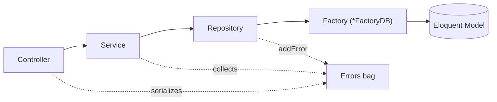

<p align="center"><a href="https://laravel.com" target="_blank"></a></p>

# Schools & Students — CRUD, REST API, OAuth2

A small Laravel application built to demonstrate two CRUD modules — **Schools** and **Students** — exposed
through both a session-authenticated admin UI and a token-authenticated REST API, plus an Artisan command
that renumbers students per school and fires an email on completion.

Originally scaffolded on Laravel 8 (see `TASK.md` for the original brief); the codebase has since been
upgraded to **Laravel 13 / PHP 8.3+**.

---

## Table of contents

- [Feature overview](#feature-overview)
- [Tech stack](#tech-stack)
- [Repository & documentation map](#repository--documentation-map)
- [Requirements](#requirements)
- [Installation](#installation)
  - [Quick start (SQLite)](#quick-start-sqlite)
  - [Using MySQL instead](#using-mysql-instead)
- [Running the app](#running-the-app)
- [Database schema](#database-schema)
- [Authentication](#authentication)
- [REST API reference](#rest-api-reference)
- [Admin area](#admin-area)
- [The `students:order` command](#the-studentsorder-command)
- [Architecture](#architecture)
- [Testing](#testing)
- [Code style](#code-style)
- [Postman collection](#postman-collection)
- [Known issues & upgrade notes](#known-issues--upgrade-notes)
- [Project structure](#project-structure)

---

## Feature overview

| Area | What it does |
| --- | --- |
| **Schools CRUD** | `name` + soft deletes. Managed via the admin UI; API exposes list only. |
| **Students CRUD** | `name`, `school_id`, auto-assigned `order`, soft deletes. Full CRUD over the REST API and the admin UI. |
| **Per-school ordering** | Every student save assigns `order` = *(last student's order in that school) + 1* via a model hook. |
| **Reorder command** | `php artisan students:order` renumbers each school's students `1..n` (closing gaps left by deletes), then dispatches an event that emails user #1. |
| **REST API** | `/api/*` resource routes guarded by Laravel Passport (`auth:api`). |
| **Admin UI** | `/admin/*` Blade pages behind session auth, with Laravel Breeze login/registration scaffolding. |

---

## Tech stack

| | |
| --- | --- |
| Framework | Laravel `^13.0` (running 13.30) |
| PHP | `^8.3` (developed on 8.5) |
| API auth | Laravel Passport `^13` (OAuth2) |
| Web auth | Laravel Breeze `^2` (Blade + Tailwind) |
| Also installed | Sanctum `^4` (unused on the API path), Inertia `^3`, Ziggy `^2` |
| Front-end build | Laravel Mix (`webpack.mix.js`) + Tailwind — **not yet migrated to Vite** |
| Tests | PHPUnit `^12` |
| Tooling | Laravel Pint, Laravel Boost (MCP for AI agents) |

---

## Repository & documentation map

| File | Audience | Purpose |
| --- | --- | --- |
| **`README.md`** | Humans | This file — setup, API reference, day-to-day usage. |
| **`CLAUDE.md`** | Claude Code / AI agents | Architecture deep-dive, upgrade status, testing gotchas, "do things the Laravel way" rules. Ends with an appended **Laravel Boost guidelines** block. |
| **`AGENTS.md`** | Generic AI agents (Junie, etc.) | The Laravel Boost guidelines block on its own (same content as the tail of `CLAUDE.md`). |
| **`TASK.md`** | Humans | The original assignment brief the project was built from. Some items (e.g. a `status` column) were never implemented — see [Known issues](#known-issues--upgrade-notes). |
| **`SECURITY.md`** | Humans | GitHub security-policy template (unmodified boilerplate). |
| **`schools_students_Api_crud.postman_collection.json`** | Humans | Importable Postman collection for the REST API — see [Postman collection](#postman-collection). |
| **`boost.json`** | Tooling | Laravel Boost install manifest (which agents / skills / MCP were enabled). |
| **`.mcp.json`** | Tooling | Registers the `laravel-boost` MCP server (`php artisan boost:mcp`) for Claude Code. |
| **`.styleci.yml`** | Tooling | StyleCI config (`laravel` preset). `vendor/bin/pint` is the local equivalent. |
| **`.editorconfig`** | Tooling | 4-space indent, LF, trailing-whitespace trim. |
| **`phpunit.xml`** | Tooling | Test-suite config (`Unit` + `Feature`). |
| **`composer.json` / `package.json`** | Tooling | PHP / JS dependencies. |

---

## Requirements

- PHP **8.3+** with `pdo_sqlite` (or `pdo_mysql`), `mbstring`, `openssl`, `tokenizer`, `xml`, `ctype`, `json`
- [Composer](https://getcomposer.org/) 2.x
- Node.js 18+ and npm (for building front-end assets)
- MySQL 5.7+/8.0 **only if** you don't use the SQLite quick start

---

## Installation

### Quick start (SQLite)

No database server needed — the app ships configured for a local SQLite file.

```bash
# 1. Dependencies
composer install
npm install

# 2. Environment
cp .env.example .env
php artisan key:generate
#   .env already sets APP_ENV=local, APP_DEBUG=true.
#   Ensure the DB block reads:  DB_CONNECTION=sqlite   (the DB_HOST/PORT/... lines can stay commented out)

# 3. Database
touch database/database.sqlite
php artisan migrate
php artisan db:seed --class=AdminSeeder        # admin user  →  admin@gmail.com / 123456

# 4. OAuth (Passport)
php artisan passport:keys                       # writes storage/oauth-{private,public}.key
php artisan passport:client --password --name="Password Grant Client" --no-interaction
#   Copy the printed Client ID / Secret into the Postman collection variables (or your .env).

# 5. Front-end assets
npm run dev
```

> `php artisan db:seed` (without `--class`) currently **fails** — `DatabaseSeeder` references a
> `SchoolSeeder` class that isn't in the repo. Seed `AdminSeeder` directly, or add the missing seeder.

### Using MySQL instead

1. Create a database and edit `.env`:

   ```dotenv
   DB_CONNECTION=mysql
   DB_HOST=127.0.0.1
   DB_PORT=3306
   DB_DATABASE=schools_students
   DB_USERNAME=root
   DB_PASSWORD=
   ```
2. Run steps 3–5 above (skip `touch database/database.sqlite`).

---

## Running the app

```bash
php artisan serve            # http://127.0.0.1:8000
npm run dev                  # or: npm run watch  /  npm run prod
```

| URL | What |
| --- | --- |
| `http://127.0.0.1:8000/` | Laravel welcome page |
| `http://127.0.0.1:8000/login` | Breeze login (session auth) |
| `http://127.0.0.1:8000/dashboard` | Post-login landing page |
| `http://127.0.0.1:8000/admin/schools` | Schools admin CRUD |
| `http://127.0.0.1:8000/admin/students` | Students admin CRUD |
| `http://127.0.0.1:8000/api/...` | REST API (Bearer token required) |

---

## Database schema

```
schools                         students
-------                         --------
id            bigint PK         id            bigint PK
name          varchar           name          varchar
created_at    timestamp         school_id     bigint FK → schools.id
updated_at    timestamp         order         bigint          (auto-assigned)
deleted_at    timestamp NULL    created_at    timestamp
                                updated_at    timestamp
                                deleted_at    timestamp NULL
```

- Both models use **soft deletes** (`Illuminate\Database\Eloquent\SoftDeletes`).
- `School hasMany Student`; `Student belongsTo School`.
- `Student::order` is set on every save by a `saving` model hook:
  `order = School::getOrder($school_id)` = the current highest `order` in that school + 1
  (`saveQuietly()` bypasses the hook — used by the reorder command).
- The OAuth / Passport tables (`oauth_*`) and Sanctum's `personal_access_tokens` come from the standard
  published migrations.

---

## Authentication

The API guard `api` uses the **Passport** driver (`config/auth.php`), and `App\Models\User` uses
`Laravel\Passport\HasApiTokens`. Every `/api/*` route below is behind `auth:api` — requests without a
valid Bearer token get `401 {"message":"Unauthenticated."}`.

> If you see `500 LogicException: Invalid key supplied`, the OAuth keys are missing — run
> `php artisan passport:keys`.

### Option A — OAuth2 password grant (what the Postman collection uses)

`AuthServiceProvider::boot()` calls `Passport::enablePasswordGrant()` (it is off by default in Passport 11+).
Create a password-grant client once:

```bash
php artisan passport:client --password --name="Password Grant Client" --no-interaction
```

Then exchange credentials for a token:

```bash
curl -X POST http://127.0.0.1:8000/oauth/token \
  -H "Content-Type: application/json" -H "Accept: application/json" \
  -d '{
        "grant_type": "password",
        "client_id": "<CLIENT_ID>",
        "client_secret": "<CLIENT_SECRET>",
        "username": "admin@gmail.com",
        "password": "123456",
        "scope": ""
      }'
# → { "token_type": "Bearer", "expires_in": 31536000, "access_token": "...", "refresh_token": "..." }
```

### Option B — personal access token (quick, for scripts/tests)

```bash
php artisan passport:client --personal --no-interaction     # once
php artisan tinker --execute="echo App\Models\User::first()->createToken('cli')->accessToken;"
```

### Calling the API

```bash
curl http://127.0.0.1:8000/api/students \
  -H "Accept: application/json" \
  -H "Authorization: Bearer <ACCESS_TOKEN>"
```

---

## REST API reference

Base URL: `http://127.0.0.1:8000`  ·  All routes require `Authorization: Bearer <token>` unless noted.
Rate limited to **60 requests/min** per user (`throttle:api`).

| Method | Endpoint | Description | Auth |
| --- | --- | --- | --- |
| `POST` | `/oauth/token` | Issue / refresh an OAuth token | none |
| `GET` | `/api/user` | The authenticated user | Bearer |
| `GET` | `/api/students` | List all students | Bearer |
| `POST` | `/api/students` | Create a student | Bearer |
| `GET` | `/api/students/{id}` | Show one student | Bearer |
| `PUT`/`PATCH` | `/api/students/{id}` | Update a student | Bearer |
| `DELETE` | `/api/students/{id}` | Soft-delete a student | Bearer |
| `GET` | `/api/schools` | List all schools | Bearer |

> `POST/PUT/DELETE /api/schools*` routes are registered by `Route::resource` but **not implemented** in
> `SchoolsApiController` (only `index` exists) — calling them errors. Manage schools via `/admin/schools`.
> The `.../create` and `.../edit` resource sub-routes are likewise unimplemented for the API.

### Payloads & validation

**Create / Update student** — body:

```json
{ "name": "Jane Student", "school_id": 1 }
```

| Field | Rules |
| --- | --- |
| `name` | required, 5–50 characters |
| `school_id` | required, must exist in `schools` |

`order` is **not** accepted from the client — it is assigned automatically.

### Response shapes

Write actions always return **HTTP 200** with an envelope:

```jsonc
// success
{ "success": true,  "message": "created", "errors": [] }          // or "updated" / "deleted"

// domain/service error
{ "success": false, "message": "errors",  "errors": ["<message>", ...] }

// validation failure (thrown by the Api form requests)
{ "success": false, "message": "Validation errors", "data": { "name": ["The name field is required."] } }
```

Reads:

```jsonc
// GET /api/students
{ "students": [
    { "id": 1, "name": "Electa Fritsch", "order": 1, "school_id": 1,
      "created_at": "2026-09-02T08:15:38.000000Z", "updated_at": "...", "deleted_at": null }
] }

// GET /api/students/{id}
{ "success": true, "message": "found", "student": { ...single student... }, "errors": [] }

// GET /api/schools
{ "schools": [ { "id": 1, "name": "Test School", "created_at": "...", "updated_at": "...", "deleted_at": null } ] }
```

---

## Admin area

Session-authenticated Blade UI under the `/admin` prefix (`routes/auth.php`), reachable after logging in
via Breeze (`/login`, `/register`).

| Route | Controller | Actions |
| --- | --- | --- |
| `/admin/schools` | `SchoolsAdminController` | `index`, `store`, `edit`, `update`, `destroy` |
| `/admin/students` | `StudentsAdminController` | `index`, `store`, `edit`, `update`, `destroy` |

Admin write requests are gated by form requests that authorize **only user #1** (`Auth::id() == 1`) for
schools; student create/update currently authorize everyone.

---

## The `students:order` command

```bash
php artisan students:order
```

1. For every **non-trashed** school, re-sets its students' `order` to a gap-free `1..n` sequence
   (`saveQuietly()`, so the per-save ordering hook doesn't interfere).
2. Dispatches `App\Events\SendEmailEvent`.
3. The `App\Listeners\StudentsOrderCommandEnd` listener then:
   - creates **50** students via `Student::factory()`, and
   - emails user #1 the `App\Mail\StudentsOrdered` mailable
     (plain-text view `resources/views/emails/students_ordered.blade.php`).

Mail uses the `.env` mailer. With the defaults (`MAIL_MAILER` unset / `log`) the message is written to
`storage/logs/laravel.log` rather than sent.

---

## Architecture

Requests flow through a deliberate layering on top of Laravel's MVC:



- **Controllers** `new` their service directly (no DI container binding). API controllers return HTTP 200
  for everything with a `{ success, message, errors }` body.
- **Services** (`app/Services/**`) turn the request into a plain `stdClass`, call the repository, and
  translate its boolean result + error list into a response.
- **Repository** (`app/Repositories/Repository.php`) is one generic CRUD class over any `Model`;
  `create`/`update` take a `FactoryInterface` + `stdClass`, the rest take a `Model` instance.
- **`*FactoryDB`** classes hydrate a new-or-existing model from a `stdClass` (these are **not** Laravel's
  database factories, which live in `database/factories/` for tests/seeders).
- **Error propagation** — `App\Errors\Errors` (`addError()` / `getErrors()`) is the base class for both
  `Services` and `Repository`; errors bubble outward into the JSON response.
- **Framework wiring** lives in `bootstrap/app.php` + `bootstrap/providers.php` (Laravel 11+ style — there
  are no `Http`/`Console` Kernel classes). `RouteServiceProvider` still registers `routes/{web,api}.php`,
  owns the `api` rate limiter, and holds the `HOME = /dashboard` constant.

See **`CLAUDE.md`** for the fuller write-up.

---

## Testing

```bash
php artisan test                                   # whole suite
php artisan test tests/Feature/StudentApiCrudTest.php
php artisan test --filter test_create_student
vendor/bin/phpunit --testsuite=Feature             # or Unit
```

- Tests run against the **configured DB connection** (`phpunit.xml` leaves the `:memory:` lines commented
  out) and use `DatabaseTransactions`, not `RefreshDatabase` — so migrate + seed the target database and
  make sure `User::find(1)` and at least one `schools` row exist first.
- API tests authenticate with `Passport::actingAs(User::find(1))`, which needs the OAuth keys present.

> ⚠️ **The suite currently does not run under PHPUnit 12** — several test classes override
> `TestCase::__construct()`, which PHPUnit 12 made `final`. Move the Faker setup into `setUp()` (or the
> `WithFaker` trait) and drop the constructors. Tracked in [Known issues](#known-issues--upgrade-notes).

---

## Code style

```bash
vendor/bin/pint          # apply fixes
vendor/bin/pint --test   # check only
```

`.styleci.yml` (`laravel` preset, `no_unused_imports` disabled) is the historical gate; Pint is the local
equivalent. `.editorconfig` enforces 4-space indent / LF.

---

## Postman collection

Import **`schools_students_Api_crud.postman_collection.json`**.

1. Open the collection's **Variables** tab and set `base_url`, `client_id`, `client_secret`
   (from `php artisan passport:client --password`), `username`, `password`.
2. Run **Auth → Login (Password Grant)** — its test script stores `access_token` / `refresh_token` as
   collection variables.
3. Every other request inherits **Bearer `{{access_token}}`** from the collection, so just run them.
   Use **Auth → Refresh Token** when the token expires.

Folders: **Auth** (login, refresh, current user), **Students** (full CRUD), **Schools** (list only).

---

## Known issues & upgrade notes

| Item | Status |
| --- | --- |
| PHPUnit 12 `final TestCase::__construct()` breaks `SchoolsServiceTest`, `StudentsServiceTest`, `StudentApiCrudTest`, `TestRepositoriesMainClassTest` | **open** — see [Testing](#testing) |
| `php artisan db:seed` fails — `DatabaseSeeder` calls a missing `SchoolSeeder` | **open** — use `--class=AdminSeeder` or add the seeder |
| `SchoolsApiController` only implements `index` | by design here; other `schools` API routes error |
| `status` column on `schools` / `students` (asked for in `TASK.md`) | **not implemented** |
| Front-end still on Laravel Mix; Laravel 11+ expects Vite | **open** |
| Inertia `^3` and Breeze `^2` installed but the admin UI is plain Blade | works; no migration done |
| `config/*` not fully re-diffed against a fresh Laravel 13 skeleton (`cors.php` now framework-managed; the old `oauth_*` / `personal_access_tokens` migrations predate Passport 12 / Sanctum 4) | **open** |

Full upgrade history and rationale: **`CLAUDE.md` → "Upgrade: done vs. outstanding"**.

---

## Project structure

```
app/
├── Console/Commands/FixStudentOrder.php     students:order
├── Errors/                                  Errors base class + interface
├── Events/SendEmailEvent.php                fired when students:order finishes
├── Factories/*FactoryDB.php                 stdClass → Model hydrators (FactoryInterface)
├── Http/
│   ├── Controllers/{Schools,Students}/      *ApiController (REST) + *AdminController (web)
│   └── Requests/{Schools,Students}/         form requests; Students/Api/* return JSON on failure
├── Listeners/StudentsOrderCommandEnd.php    seeds 50 students + emails user #1
├── Mail/StudentsOrdered.php
├── Models/{School,Student,User}.php
├── Providers/                               App, Auth (Passport), Event, Route
├── Repositories/                            generic Repository + per-entity subclasses
└── Services/{Schools,Students}/             request → repository orchestration

bootstrap/app.php          Laravel 11+ application config (routing, middleware, exceptions)
bootstrap/providers.php    app service-provider list
database/
├── factories/             SchoolFactory, StudentFactory, UserFactory
├── migrations/            users, oauth_*, personal_access_tokens, schools, students
└── seeders/               DatabaseSeeder (broken), AdminSeeder
routes/
├── api.php                Passport-guarded resource routes
├── auth.php               Breeze auth routes + /admin resource routes
├── web.php  console.php  channels.php
resources/views/           welcome, dashboard, auth/*, layouts/*, schools/*, students/*, emails/*
tests/{Feature,Unit}/
```
